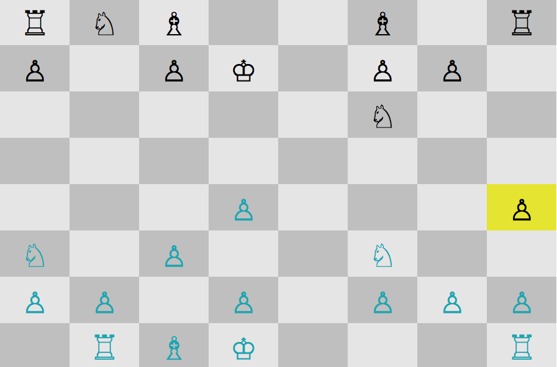

About this Project:

* I started this project with a partner during Week 2 of App Academy and finished it on my own at the end of the program.
* The game is built using Ruby and contains a user interface and a simple Computer AI to play against.
* Currently the Computer will choose a move that captures its opponents piece (if possible). I am working to implement it so the Computer will choose the move that gives the computer the greatest gain in value from a captured piece, taking into account any loss in value the Computer may suffer as a direct result of the move.

How to Run the Files:

* You will need Ruby installed to run these files. You can find instructions for installing Ruby [here] (http://installrails.com/steps/choose_os).
* Open your terminal and type: git clone https://github.com/dbkid/Chess.git
* Navigate to the folder "Chess" by typing "cd Chess".
* Run the command $ bundle install from within the Chess folder.
* Run the command $ ruby game.rb to start the game.

How to Play:

* You go first and start the game as black (located on the top of the board). The computer starts the game as blue (located on the bottom of the board).
* Navigate around the board using the arrow keys.
* When you get to the piece you want to move, select the piece with the space bar. Navigate to where you want to move using the arrow keys. The piece will be dragged along with you. Hit the space bar again to place the piece where you want.
* The computer will respond with its move.
